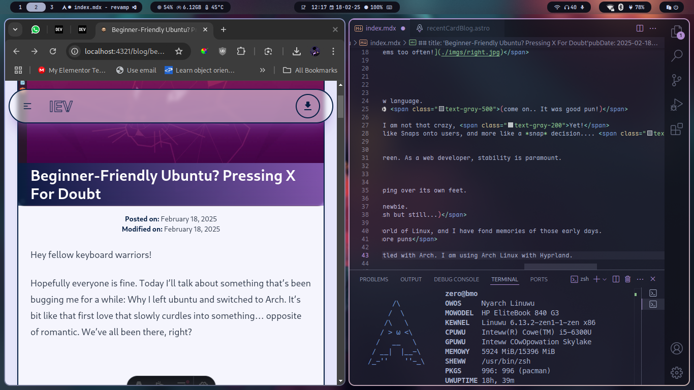

Hey fellow keyboard warriors! 

Ah, Ubuntu. The distro that once felt like a warm welcoming hug for new linux users like me. Back 2016, When Unity was the face of Ubuntu. The slick launcher, the HUD Search, The MacOS like global menu, it all ran like butter on my potato laptop, everything *just worked*.

It was love at first <code class="bg-gray-800 text-white py-1 px-2 rounded-md text-xs">sudo apt-get install</code>
but the love with Ubuntu had ended long ago, and now *Arch is my new best-friend*.

## **The Great Desktop Betrayal: Unity To Gnome**

Remember Unity? Not the Unity from Rick'n'Morty, I am taking about the Desktop Environment.. When I switched from windows to Ubuntu and I saw it boot up for the first time, it felt like a futurictic spaceship dashboard, to me atleast it looked like that way I can't speak for others.

Then Ubuntu swapped it for gnome, while I understand the reasons behind it, to me it felt like being forced to learn a new language.
My carefully crafted workflow? Gone! My muscle memory? In shambles...  It was like they'd taken my comfortable armchair and replaced it with a gnome 👀 (*come on.. It's good pun!*)

But I still used gnome for while I mean, I know that I am a toxic linux enthusiast but I am not that crazy, Yet!. I didn't leave Ubuntu as soon as they switched to Gnome. No I gave it a chance.

## **Snap Decisions: Forced Packaging & Bloatware Blues**

The aggressive push for Snap packages slow, sandboxed, & stubbornly auto-updating had turned my workflow into a loading screen simulator.
Want to <code class="text-xs text-white bg-gray-800 py-1 px-2 rounded-md">apt-get</code> a .deb package? Prepare for a Snap-shaped roadblock.
Like it's trying to be Windows, but without the you know, *Windows Part*. 

Snaps aren't inherently evil, but forcing them down users' throats?
That's not the Linux ethos. Where's the freedom of Flatpaks (*Not that I use these in the first place but still a choice is a choice*), AppImages, or good ol' binaries? 

Add to that the bloat-Ubuntu now boots slower than my coffee maker and it's clear the "lightweight" days are over.
*but it's their distro 🤓* (Duh! It's their distro, You think I don't that?) The whole point of Linux in my two-brain-celled opinion, is freedom of choice. That's what drew me to it in the first place!

## **Stability? More Like "Breakability"**
Ubuntu becoming increasingly unfriendly which is ironic considering how beginner-friendly it used to be. I remember when Ubuntu was the go-to distro for newbie.

Don't even get me started on the increasing number of issues that latest builds have, Ubuntu's poping errors left n right even on the installation screen.

Back in the day, Ubuntu was the rock-solid distro you’d recommend to your grandma. Now? I wouldn't recommend it to my grandma, 
(*even though she's dead and didn't know how to read/write let alone know english but still...*)

### **Arch is not stable** ☝️🤓

Arch is very stable you just need to know what you are doing, Arch Wiki has so much detailed information for us Nerds but we'll talk about that some other day, today I'm here to b*tch about Ubuntu.
I'm seeing more n more compatibility issues & general weirdness that makes Ubuntu feel less like a reliable workhorse and more like a horse that's tripping over its own feet.

## **If Not Ubuntu Then What?**
Anyway Ubuntu was my gateway to the world of Linux, and I have fond memories of those early days.
We had something special but now you're the Windows 11 of Linux distros.

Flashy, opinionated, and allergic to user agency, for devs craving for stability and freedom, alternatives like Fedora, Mint and Even Arch are stepping up while Ubuntu's tripping over its own snaps.

## **Conclusion: It’s Not Me, It’s You**
It's a real shame, because I genuinely loved Ubuntu. Thinking about past love I also loved nano over vim.. maybe It *was* me hmmmm 🤔 nah! It's Ubuntu..

Anyone else feeling the same way? Let me know in the comments! After leaving Ubuntu I did use other distros but none felt the same way at the end I settled with Arch. I am using Arch Linux with Hyprland. Below is a screenshot of it as of writing this post *literally*.

look at that cute little arch logo, how can you not love it?
