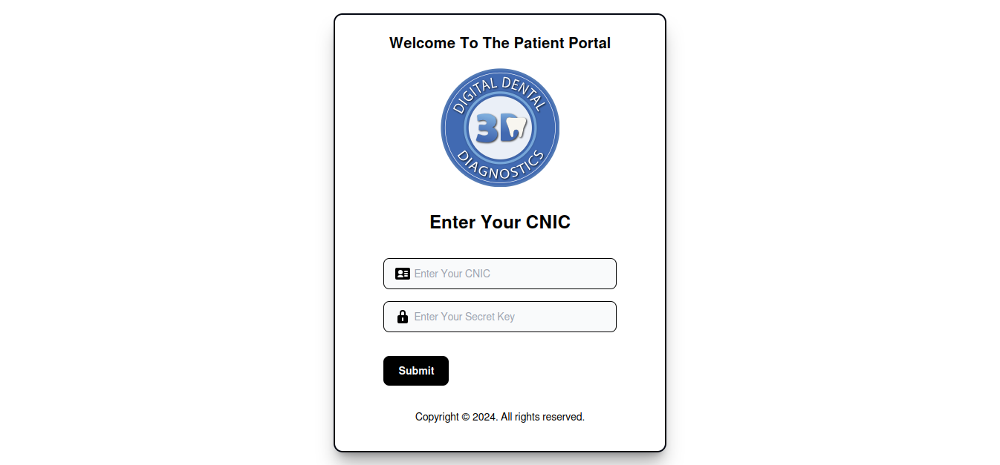

## The Challenge

At Arox Marketing, we were primarily a front-end development agency. Our expertise lay in crafting visually appealing and user-friendly websites using WordPress page builders. However, a long-standing client approached us with a unique challenge: they needed a robust website to manage their patients, assign doctors, and generate patient receipts.

## The Dilemma

The twist? We didn't have the backend development expertise required for such a complex project. Outsourcing wasn't an option, as it would disrupt the collaborative nature of our client relationship. Refusing the project wasn't feasible either, given our long-standing partnership.

## The Solution: A Bold Decision

Faced with this daunting task, I made a bold decision: to dive headfirst into the world of backend development, specifically PHP. I dedicated four intensive weeks to learning the fundamentals of PHP, its syntax, and its application in web development.

## The Outcome: A Successful Delivery

Within a remarkably short timeframe, I was able to leverage my newfound PHP skills to create a functional website. This platform empowered our client to efficiently manage their patients, assign doctors, and generate patient receipts.
This experience was a testament to the power of determination and the ability to adapt to new challenges. It also reinforced the importance of continuous learning and embracing opportunities to expand one's skillset.